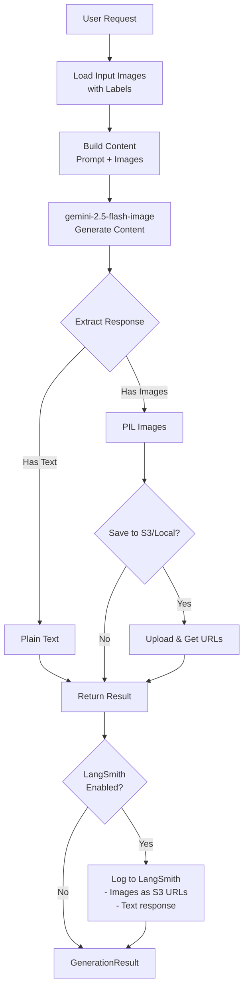

# gemini-imagen

[](https://badge.fury.io/py/gemini-imagen)
[](https://www.python.org/downloads/)
[](https://opensource.org/licenses/MIT)
[](https://github.com/aviadr1/gemini-imagen/actions/workflows/ci.yml)
[](https://codecov.io/gh/aviadr1/gemini-imagen)

A comprehensive Python wrapper for Google Gemini's image generation and analysis capabilities, featuring:

- 🎨 **Text-to-Image Generation** - Create images from text prompts
- 🏷️ **Labeled Input Images** - Reference images by name in prompts for better control
- 📸 **Multiple Output Images** - Generate multiple variations in one request
- 💬 **Image Analysis** - Get detailed text descriptions of images
- ☁️ **S3 Integration** - Seamless AWS S3 upload/download with URL logging
- 📈 **LangSmith Tracing** - Full observability for debugging and monitoring
- 🔄 **Type-Safe** - Full type hints with Pydantic validation

## Installation

### Basic Installation

Using pip:
```bash
pip install gemini-imagen
```

Using uv (recommended - faster):
```bash
uv pip install gemini-imagen
```

### With S3 Support

Using pip:
```bash
pip install gemini-imagen[s3]
```

Using uv:
```bash
uv pip install gemini-imagen[s3]
```

### From Source

Using uv (recommended):
```bash
git clone https://github.com/aviadr1/gemini-imagen.git
cd gemini-imagen
uv sync --all-extras
```

Or using pip:
```bash
git clone https://github.com/aviadr1/gemini-imagen.git
cd gemini-imagen
pip install -e ".[dev,s3]"
```

## Quick Start

### 1. Set Up API Key

```bash
export GOOGLE_API_KEY="your-api-key-here"
```

Or create a `.env` file:
```env
GOOGLE_API_KEY=your-api-key-here
```

### 2. Generate Your First Image

```python
from gemini_imagen import GeminiImageGenerator

generator = GeminiImageGenerator()

result = generator.generate(
    prompt="A serene Japanese garden with cherry blossoms",
    output_images=["garden.png"]
)

print(f"Image saved to: {result.image_location}")
```

## Features

### Text-to-Image Generation

Generate images from text descriptions:

```python
result = generator.generate(
    prompt="A futuristic cityscape at sunset with flying cars",
    output_images=["cityscape.png"]
)
```

### Image Analysis

Analyze existing images and get text descriptions:

```python
result = generator.generate(
    prompt="Describe this image in detail, including colors, objects, and mood",
    input_images=["photo.jpg"],
    output_text=True
)

print(result.text)
```

### Labeled Input Images

Reference multiple images by name in your prompts:

```python
result = generator.generate(
    prompt="Blend the artistic style from Photo A with the composition from Photo B",
    input_images=[
        ("Photo A (style):", "style_reference.jpg"),
        ("Photo B (composition):", "composition_reference.jpg")
    ],
    output_images=["blended_result.png"]
)
```

### Multiple Output Images

Request multiple variations:

```python
result = generator.generate(
    prompt="Create 3 variations of a mountain landscape",
    output_images=[
        ("Sunrise version", "mountain_sunrise.png"),
        ("Sunset version", "mountain_sunset.png"),
        ("Night version", "mountain_night.png")
    ]
)

# Note: Gemini may return fewer images than requested
for label, uri in zip(result.image_labels, result.image_locations):
    print(f"{label}: {uri}")
```

### S3 Integration

Upload/download images directly to/from AWS S3:

```python
# Configure AWS credentials in .env:
# GV_AWS_ACCESS_KEY_ID=your_key
# GV_AWS_SECRET_ACCESS_KEY=your_secret
# GV_AWS_STORAGE_BUCKET_NAME=your_bucket

result = generator.generate(
    prompt="A magical forest scene",
    input_images=["s3://my-bucket/reference.jpg"],
    output_images=["s3://my-bucket/output.png"]
)

# Access S3 URLs
print(result.image_s3_uri)    # s3://my-bucket/output.png
print(result.image_http_url)  # https://my-bucket.s3.region.amazonaws.com/...
```

### LangSmith Tracing

Enable observability with LangSmith:

```python
import os
os.environ["LANGSMITH_TRACING"] = "true"
os.environ["LANGSMITH_API_KEY"] = "your-key"

generator = GeminiImageGenerator(log_images=True)

result = generator.generate(
    prompt="A robot reading in a cozy library",
    output_images=["robot_library.png"],
    metadata={"user_id": "demo", "session": "example"},
    tags=["demo", "robot"]
)

# View traces at https://smith.langchain.com/
```

### Image + Text Output

Get both an image and explanation:

```python
result = generator.generate(
    prompt="Generate a futuristic city and explain its key architectural features",
    output_images=["city.png"],
    output_text=True
)

print(f"Image: {result.image_location}")
print(f"Explanation: {result.text}")
```

## Architecture

The package uses `gemini-2.5-flash-image` for all operations:



## API Reference

### GeminiImageGenerator

```python
generator = GeminiImageGenerator(
    model_name="gemini-2.5-flash-image",  # Image generation model
    api_key=None,                          # Auto-loads from env
    log_images=True                        # Enable LangSmith logging
)
```

### generate() Method

```python
result = generator.generate(
    prompt: str,                                      # Main prompt (required)
    system_prompt: Optional[str] = None,              # System instructions
    input_images: Optional[List[ImageSource]] = None, # Input images
    temperature: Optional[float] = None,              # Sampling temperature

    # Output configuration
    output_images: Optional[List[OutputImageSpec]] = None,  # Generate images
    output_text: bool = False,                              # Generate text

    # LangSmith
    metadata: Optional[Dict[str, str]] = None,
    tags: Optional[List[str]] = None
) -> GenerationResult
```

**Type Definitions:**

- `ImageSource = RawImageSource | LabeledImage`
  - `RawImageSource = Image.Image | str | Path`
  - `LabeledImage = Tuple[str, RawImageSource]`

- `OutputImageSpec = OutputLocation | LabeledOutput`
  - `OutputLocation = str | Path`
  - `LabeledOutput = Tuple[str, OutputLocation]`

### GenerationResult

```python
class GenerationResult:
    text: Optional[str]                      # Generated text
    images: List[Image.Image]                # PIL Image objects
    image_labels: List[Optional[str]]        # Image labels
    image_locations: List[str]               # Local file paths
    image_s3_uris: List[Optional[str]]       # S3 URIs
    image_http_urls: List[Optional[str]]     # HTTP URLs

    # Convenience properties (first image)
    @property
    def image(self) -> Optional[Image.Image]
    @property
    def image_location(self) -> Optional[str]
    @property
    def image_s3_uri(self) -> Optional[str]
    @property
    def image_http_url(self) -> Optional[str]
```

## Structured Output Limitation

⚠️ **The image model (`gemini-2.5-flash-image`) does not support JSON schemas or structured output.**

Any request for JSON or other structured responses will result in plain text
output from `gemini-2.5-flash-image`.

## Configuration

### Environment Variables

```bash
# Required
GOOGLE_API_KEY=your_google_api_key

# Optional - for S3 features
GV_AWS_ACCESS_KEY_ID=your_aws_access_key
GV_AWS_SECRET_ACCESS_KEY=your_aws_secret_key
GV_AWS_STORAGE_BUCKET_NAME=your-bucket-name

# Optional - for LangSmith tracing
LANGSMITH_API_KEY=your_langsmith_api_key
LANGSMITH_TRACING=true
```

## Examples

See the [`examples/`](examples/) directory for complete working examples:

- [`basic_generation.py`](examples/basic_generation.py) - Simple text-to-image
- [`image_analysis.py`](examples/image_analysis.py) - Analyze images
- [`labeled_inputs.py`](examples/labeled_inputs.py) - Use labeled images
- [`s3_integration.py`](examples/s3_integration.py) - S3 upload/download
- [`langsmith_tracing.py`](examples/langsmith_tracing.py) - Enable tracing

## Pricing

### Image Generation (gemini-2.5-flash-image)
- **Cost**: $30/1M output tokens
- **Per Image**: ~$0.039 (1290 tokens at 1024x1024)

### Text Model (gemini-2.5-flash)
- **Input**: $0.30/1M tokens
- **Output**: $1.20/1M tokens

## Limitations

- **Multiple images**: Gemini may not always generate the exact number requested
- **Structured output**: Only available with text model (separate call required)
- **Rate limits** (free tier): 10 requests/minute, 1500/day

## Development

### Setup Development Environment

**Using uv (recommended):**
```bash
# Clone the repository
git clone https://github.com/aviadr1/gemini-imagen.git
cd gemini-imagen

# Lock dependencies and sync (installs everything)
uv lock
uv sync --all-extras

# Install pre-commit hooks
uv run pre-commit install
```

**Or using pip:**
```bash
# Clone the repository
git clone https://github.com/aviadr1/gemini-imagen.git
cd gemini-imagen

# Install with development dependencies
pip install -e ".[dev,s3]"

# Install pre-commit hooks
pre-commit install
```

### Running Tests

**Using uv:**
```bash
# Run unit tests only (no API keys required)
uv run pytest tests/ -v -m "not integration"

# Run all tests including integration (requires API keys)
uv run pytest tests/ -v

# Run with coverage
uv run pytest tests/ -v -m "not integration" --cov=gemini_imagen --cov-report=html

# Run specific test file
uv run pytest tests/test_gemini_image_wrapper.py -v
```

**Using make (with uv):**
```bash
make test    # Runs: uv run pytest (unit tests only)
```

**Test Categories:**
- **Unit tests**: Mocked tests, no API keys required
- **Integration tests**: Require real API keys (`-m integration`)
  - `GOOGLE_API_KEY` - for Gemini API tests
  - `GV_AWS_*` - for S3 integration tests
  - `LANGSMITH_API_KEY` - for LangSmith tracing tests

Integration tests are automatically skipped if credentials are missing.

### Code Quality

```bash
# Run linter
make lint

# Format code
make format

# Run pre-commit hooks
make pre-commit
```

### Building and Publishing

#### Quick Release Process

**One command to release:**
```bash
# Patch release (0.1.0 -> 0.1.1) - default
./scripts/release.sh

# Minor release (0.1.0 -> 0.2.0)
./scripts/release.sh minor

# Major release (0.1.0 -> 1.0.0)
./scripts/release.sh major

# Test on TestPyPI first
./scripts/release.sh patch --test
```

The release script automatically:
1. Bumps the version (patch/minor/major)
2. Commits the version change
3. Creates and pushes a git tag
4. Installs dependencies
5. Runs linters (ruff + mypy)
6. Runs tests
7. Builds the package
8. Verifies with twine
9. Uploads to PyPI (with confirmation)

**Manual version bump (if needed):**
```bash
# Bump version manually
uv run python scripts/bump_version.py patch  # 0.1.0 -> 0.1.1
uv run python scripts/bump_version.py minor  # 0.1.0 -> 0.2.0
uv run python scripts/bump_version.py major  # 0.1.0 -> 1.0.0
```

#### Manual Build/Publish

```bash
# Build package
make build

# Publish to PyPI (requires credentials)
make publish
```

## CI/CD

This project uses GitHub Actions for continuous integration:

- **CI Pipeline**: Runs on every push and pull request
  - Linting with ruff
  - Type checking with mypy
  - Tests on Python 3.12 and 3.13
  - Code coverage reporting

- **Release Pipeline**: Automatically publishes to PyPI on version tags
  - Triggered by pushing tags like `v1.0.0`
  - Creates GitHub releases with artifacts

- **Dependabot**: Automatically updates dependencies weekly

## Contributing

Contributions are welcome! Please see [CONTRIBUTING.md](CONTRIBUTING.md) for guidelines.

## License

MIT License - see [LICENSE](LICENSE) for details.

## Acknowledgments

- Built on [`google-genai`](https://github.com/googleapis/python-genai) - Google's unified GenAI SDK (replaces deprecated `google-generativeai`)
- Uses [`langsmith`](https://github.com/langchain-ai/langsmith-sdk) for tracing
- S3 integration via [`boto3`](https://github.com/boto/boto3)
- Type validation with [`pydantic`](https://github.com/pydantic/pydantic) v2

## Support

- **Issues**: [GitHub Issues](https://github.com/aviadr1/gemini-imagen/issues)
- **Documentation**: [README](https://github.com/aviadr1/gemini-imagen#readme)
- **Examples**: [examples/](examples/)

---

Made with ❤️ by [Aviad Rozenhek](https://github.com/aviadr1)
